# PlantUML Gantt 语法参考

GanttLens 支持的 PlantUML 甘特图语法。

> GanttLens 支持 PlantUML Gantt 语法的子集。完整语法请参考
> [PlantUML 官方甘特图文档](https://plantuml.com/gantt-diagram)。

## 基本结构

```plantuml
@startgantt
[任务] lasts 5 days
@endgantt
```



## 任务定义

### 基本任务

```plantuml
[设计] lasts 5 days
[编码] lasts 10 days
```

### 使用 `requires`（等同于 `lasts`）

```plantuml
[设计] requires 5 days
[编码] requires 10 days
```

### 使用 `lasts`（推荐）

```plantuml
[设计] lasts 5 days
[编码] lasts 2 weeks
```

## 别名（as）

使用 `as` 为任务创建简短别名，便于引用：

```plantuml
[详细设计文档] as [D] lasts 5 days
[编码实现] starts at [D]'s end lasts 10 days
```

## 依赖关系

### 使用 `then`

```plantuml
[设计] lasts 5 days
then [编码] lasts 10 days
then [测试] lasts 5 days
```

### 使用 `starts at`

```plantuml
[设计] lasts 5 days
[编码] starts at [设计]'s end lasts 10 days
```

### 使用 `->` 箭头

```plantuml
[设计] lasts 5 days
[编码] lasts 10 days
[测试] lasts 5 days
[设计] -> [编码] -> [测试]
```

## 里程碑（happens）

```plantuml
[设计] lasts 5 days
[编码] lasts 10 days
发布 happens at [编码]'s end
```

### 固定日期里程碑

```plantuml
项目发布 happens on 2026-07-15
```

## 持续时间单位

```plantuml
[短期任务] lasts 3 days
[中期任务] lasts 2 weeks
```

- `days`：工作日
- `weeks`：周（1 周 = 5 个工作日）

## 项目配置

### 项目起始日期

```plantuml
project starts 2026-07-01
```

### 标题

```plantuml
title 我的项目计划
```

## 工作日设置

### 周末关闭

```plantuml
saturday are closed
sunday are closed
```

### 特定日期关闭

```plantuml
2026-07-04 is closed
```

### 日期范围关闭

```plantuml
2026-07-01 to 2026-07-05 is closed
```

### 重新打开日期

```plantuml
2026-07-04 is closed
2026-07-04 is open
```

## 人员分配

### 基本分配

```plantuml
[设计] on {张三} lasts 5 days
[编码] on {李四} lasts 10 days
```

### 多人分配

```plantuml
[设计] on {张三} {李四} lasts 5 days
```

### 比例分配

```plantuml
[设计] on {张三:50%} {李四:50%} lasts 5 days
```

### 人员休假

```plantuml
{张三} is off on 2026-07-04
```

## 任务状态

### 标记完成

```plantuml
[设计] lasts 5 days is completed
[编码] lasts 10 days
```

### 部分进度

```plantuml
[设计] lasts 5 days is 60% complete
[编码] lasts 10 days is 30% complete
```

## 注释

### 行注释

```plantuml
' 这是一个注释
[设计] lasts 5 days
```

### 块注释

```plantuml
/' 这是一个
多行注释 '/
[设计] lasts 5 days
```

## 分组

```plantuml
--第一阶段--
[需求分析] lasts 5 days
[设计] lasts 7 days

--第二阶段--
[编码] lasts 14 days
[测试] lasts 5 days
```

## 完整示例

```plantuml
@startgantt
title 软件开发项目
project starts 2026-07-01
saturday are closed
sunday are closed
2026-07-04 is closed

--需求阶段--
[需求收集] lasts 5 days
[需求评审] starts at [需求收集]'s end lasts 2 days

--设计阶段--
[架构设计] starts at [需求评审]'s end lasts 7 days
[详细设计] starts at [架构设计]'s end lasts 5 days

--开发阶段--
[编码] starts at [详细设计]'s end lasts 14 days
[代码评审] starts at [编码]'s end lasts 3 days

--测试阶段--
[单元测试] starts at [代码评审]'s end lasts 5 days
[集成测试] starts at [单元测试]'s end lasts 5 days

发布 happens at [集成测试]'s end

[需求收集] -> [需求评审] -> [架构设计] -> [详细设计] -> [编码] -> [代码评审] -> [单元测试] -> [集成测试]
@endgantt
```
