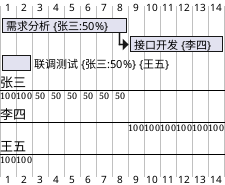

# PlantUML Gantt 分析增强工具灵感

## 背景

PlantUML 的甘特图语法很适合用文本维护排期：轻量、可版本化、能嵌入 Markdown/技术文档，也方便通过 Git Review 追踪排期变化。

但 PlantUML 本身更偏向“渲染图”，不擅长回答排期背后的统计问题，例如：

- 某个人在某个周期内投入了多少人天
- 哪些日期存在人员超载
- 某个人当前有哪些任务
- 某个阶段、模块或版本消耗了多少资源
- 哪些任务没有负责人或缺少明确时间
- 任务延期会影响哪些后续任务

因此可以考虑基于 PlantUML Gantt 语法做一个分析增强工具：继续使用 `.puml` 作为源文件，同时提供交互式甘特图、人员视图和统计图表。

## 核心定位

一句话定位：

> 用 PlantUML 写排期，用图表看人力。

它不是替代 PlantUML，而是作为 PlantUML Gantt 的分析层和交互层。

适合场景：

- 工程团队已经习惯 Markdown、Git、PlantUML
- 希望排期文档和代码、设计文档一起版本化
- 不想引入 Jira、飞书项目、MS Project 等重型项目管理工具
- 技术负责人需要快速查看人员投入、任务分布、超载风险
- 交付类项目需要周期性输出人力统计和项目进度报表

## 目标用户

- 技术负责人
- 项目负责人
- 研发组长
- 交付经理
- 喜欢文档即代码工作流的工程团队

## 可支持的 PlantUML Gantt 子集

MVP 阶段不必完整兼容所有 PlantUML Gantt 语法，可以先支持最能产生统计价值的一组：



优先支持：

- `[任务] requires N days`
- `[任务] starts at YYYY-MM-DD`
- `[任务] starts at [前置任务]'s end`
- `[任务] on {人员}`
- `[任务] on {人员:百分比}`
- 多人协作任务
- 周末/节假日关闭
- 某个人休假
- 任务分组或阶段标记

## 核心功能

### 1. 甘特图渲染

- 解析 `.puml` 文件
- 展示交互式甘特图
- 支持任务悬浮查看详情
- 支持按人员、阶段、标签过滤
- 支持点击任务查看依赖和负责人

### 2. 人员视图

- 展示某个人的所有任务
- 展示该人员每日/每周投入
- 展示空闲窗口
- 展示超载日期
- 支持按时间范围过滤

### 3. 统计面板

- 项目总人天
- 每个人总投入
- 每周投入趋势
- 阶段投入占比
- 任务数量统计
- 未分配任务列表
- 超载任务列表

### 4. 风险检查

- 人员单日投入超过 100%
- 任务没有负责人
- 任务没有明确开始时间
- 任务依赖不存在
- 存在循环依赖
- 周末/休假日被安排任务
- 关键路径过长

### 5. 报表导出

- 导出 Markdown 周报
- 导出 CSV 人天统计
- 导出 Excel 投入明细
- 导出 PNG/SVG 甘特图
- 导出 HTML Dashboard

## 推荐 MVP

第一版可以只做以下内容：

- 输入或打开 `.puml` 文件
- 解析任务、负责人、投入比例、开始时间、持续时间
- 渲染一个基础甘特图
- 显示每个人总人天
- 显示某个人的任务列表
- 显示每日负载热力图
- 标红超过 100% 的日期
- 导出 CSV

MVP 的关键不是完整项目管理，而是验证这个问题是否真的高频：

> 排期已经写在 PlantUML 里了，但我想知道每个人到底排了多少活。

## 产品形态设想

### 本地 Web 工具

- 前端：Vue/React + ECharts
- 解析器：TypeScript 实现
- 文件输入：拖拽 `.puml`
- 输出：HTML 图表、CSV、Markdown

优点：轻量、好分发、交互体验好。

### CLI 工具

```bash
puml-gantt-analyzer plan.puml --out report.html
puml-gantt-analyzer plan.puml --csv workload.csv
puml-gantt-analyzer plan.puml --person 张三
```

优点：适合 CI、文档自动化、周报自动生成。

### VS Code 插件

- 编辑 `.puml` 时右侧展示统计
- 鼠标悬浮任务显示人天和依赖
- 保存时检查超载/依赖问题

优点：贴合工程团队日常工作流。

## 数据模型草案

```ts
interface Task {
  id: string;
  name: string;
  start?: string;
  end?: string;
  durationDays?: number;
  dependencies: string[];
  assignments: Assignment[];
  tags: string[];
  group?: string;
}

interface Assignment {
  person: string;
  ratio: number; // 1 表示 100%
}

interface PersonDailyLoad {
  person: string;
  date: string;
  load: number;
  tasks: string[];
}
```

## 关键挑战

- PlantUML Gantt 语法不是严格标准，完整兼容成本高
- 自然语言式 DSL 需要控制解析范围
- 日期推导、工作日、节假日、休假会影响统计准确性
- 任务依赖链可能复杂，需要拓扑排序
- 文本自由度太高时，统计结果可能不稳定

应对方式：

- 第一版只支持明确子集
- 对不支持语法给出 warning，而不是静默忽略
- 提供推荐写法规范
- 后续再逐步兼容更多 PlantUML 语法

## 差异化价值

相比单纯 PlantUML：

- 不只画图，还回答人力和风险问题
- 支持人员视图和统计图表
- 支持导出报表

相比传统项目管理软件：

- 文本源文件可版本化
- 适合 Git Review
- 更轻量
- 更适合工程文档体系

相比 Mermaid Gantt：

- PlantUML Gantt 的资源语法更适合人力统计
- 可以利用 `{人员:百分比}` 这类表达做人天计算

## 后续增强方向

- 兼容更多 PlantUML Gantt 语法
- 支持节假日配置
- 支持标签、模块、版本、里程碑
- 支持关键路径分析
- 支持资源自动均衡建议
- 支持多人协作编辑
- 支持 Git diff 后的排期变化分析
- 支持 AI 生成周报和风险摘要
- 支持从 Jira/飞书/禅道导入任务后生成 `.puml`

## 一个可能的名字

- PumlPlan
- GanttLens
- PlantGantt Insight
- Puml Gantt Analyzer
- CodePlan Gantt

## 当前判断

这个方向有价值，但要避免把重点放在“再造一个甘特图渲染器”。真正有价值的部分是：

- 资源统计
- 人员视图
- 超载检查
- 排期风险
- 报表导出
- 文档即代码工作流

最小可行切入点：

> 解析 PlantUML Gantt 文件，生成每个人的人天统计和负载图。
